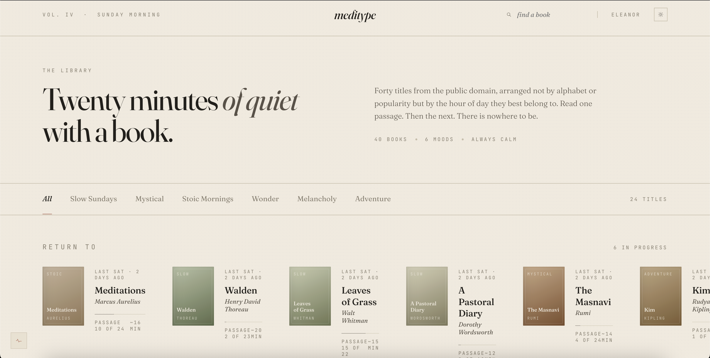
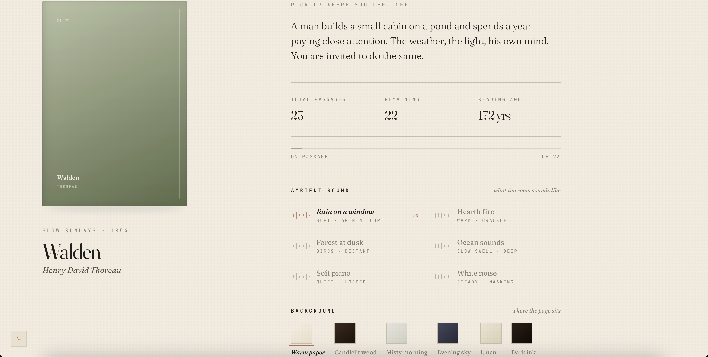
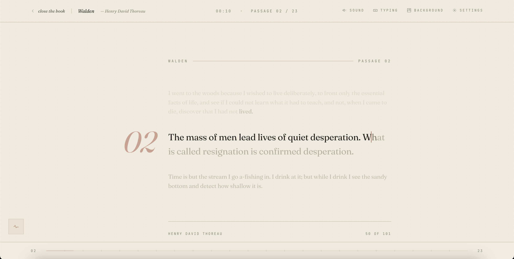

# meditype

A quiet place to type.

Pick a public-domain book, pick the sound of the room, and type through it slowly. No WPM counter, no streak to maintain, no leaderboard. Just the text and your hands, at whatever pace feels right.

**Live:** https://meditype-omega.vercel.app

---







---

## What it's for

Most typing sites are about getting faster. Meditype is about slowing down. You sit with a paragraph of Walden or Meditations or the Tao Te Ching, type it one word at a time, and let the rhythm settle something in your head. It's closer to copying out a passage by hand in a notebook than it is to drilling for a typing test.

People use it for different reasons. Some treat it like a focus warm-up before deep work. Some use it as a wind-down at the end of the day. Some use it as a way to actually finish books they've been meaning to read, one short passage per session.

## The books

Around 24 titles, all in the public domain. Organized loosely by mood:

- **Slow Sundays:** Walden, Leaves of Grass, A Pastoral Diary, Essays
- **Stoic Mornings:** Meditations, The Enchiridion, Letters from a Stoic, Self-Reliance
- **Mystical:** The Masnavi, Tao Te Ching, and others
- **Wonder, Melancholy, Adventure:** Frankenstein, Kim, and the rest

Passages are short, single paragraphs. A typical session is two to ten minutes per passage. You can stop after one or do a whole sitting; the app remembers exactly where you left off.

## Features

### Ambient sound

Rain on a window. Hearth fire. Ocean. Forest at dusk. Soft piano. White noise. Or silence if you prefer. The sound starts when you begin reading and fades out gently when you exit. Volume is adjustable mid-session via the sound popover.

### Typing sounds

Optional per-keystroke feedback. Three presets:
- **Soft keys:** a quiet membrane click
- **Fountain pen:** more of a brushed sound
- **Thocky switches:** a sample bank of real mechanical keyboard recordings, randomized so it never sounds looped

You can also have a separate sound trigger on mistakes, or turn the whole thing off if you just want the ambient.

### Backgrounds

Six paper tones for the reading surface: warm paper, candlelit wood, misty morning, evening sky, linen, dark oak. Each shifts the type color and reading temperature. There's also a Drift option that subtly changes the background while you type.

### Two reading layouts

- **Single:** one continuous column, the typed text overlays the book, drop cap on the left margin. Default.
- **Split:** the book on the left, your typing surface on the right.

Toggle between them mid-session in Settings.

### The metrics dashboard

A small portrait of how you actually type, available from the bottom-left button. Two modes depending on where you are:

- **On Library/Prepare/Complete:** cross-book aggregate. Lifetime totals, hand asymmetry (do you favor one hand?), slowest bigrams, your most-paused-on letters, and a WPM-over-time line.
- **On the Reading screen:** scoped to the current book. Live session pulse refreshing every second, this book's lifetime stats, and your in-session typing rhythm.

No score. Just the shape of how you type.

### Strict vs soft mode

Strict mode flags every wrong letter, including case. Soft mode forgives only case differences. Both keep wrong characters red until you backspace.

### Per-book progress

Every book remembers your spot. Close the tab, come back next week, you're on the same passage. Stored in localStorage, no account needed.

### Dark mode

Top-right toggle on the home screens. Cross-fade animation between paper and candlelit palettes. Your preference persists.

### Keyboard everything

Type to advance. Space or Enter to turn the page once a passage is complete. Tab resets the current passage if you want a fresh attempt. Backspace to correct. Esc to leave.

## How it works under the hood

Pure static site. No build step, no backend, no database, no auth. It's HTML plus React running in the browser via the UMD builds, transpiled in-place with Babel Standalone. Deploys to Vercel as plain files. Source layout:

```
meditype.html              entry point
tokens.css                 design tokens
data.jsx                   book seed + ambient/typing presets
passages.jsx               all 24 books' public-domain text
storage.jsx                versioned localStorage wrapper
components/
  library.jsx              shelf
  prepare.jsx              per-book settings screen
  reading.jsx              the typing surface
  complete.jsx             end-of-session screen
  popovers.jsx             Sound / Background / Settings + ambient engine
  typing-sound.jsx         per-keystroke sample engine
  dashboard.jsx            metrics portrait
  metrics-store.jsx        keystroke recording + aggregation
  hint.jsx                 onboarding hint card
  primitives.jsx           shared icons + cover + progress line
assets/                    mp3 + wav files (ambient and typing samples)
```

Progress saves through `window.saveProgressFor` into `meditype.progress` (per-book). Preferences (theme, layout, typing sound, ambient volume, strict mode) live under a versioned `meditype.v1.prefs` blob through the storage wrapper, so the schema can evolve without bricking returning users.

## Run it locally

You can open `meditype.html` in a browser directly via `file://` and it works. The ambient audio needs a user gesture to start (browser policy), which is already handled.

To run it through a local server (recommended for the cleanest behavior):

```bash
cd meditype
python3 -m http.server 8000
# then open http://localhost:8000/meditype.html
```

## Deploying

Already deployed to Vercel as a static site, auto-deploying on every push to main. See `DEPLOY.md` for the original handoff and `HANDOFF.md` for the day-to-day workflow notes.

## License

The app code is mine. The book passages are all in the public domain (pre-1928 English translations or original works), sourced from Project Gutenberg, Wikisource, and archive.org.

If you find it useful or want to suggest a book, open an issue.
